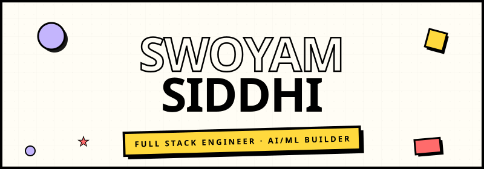
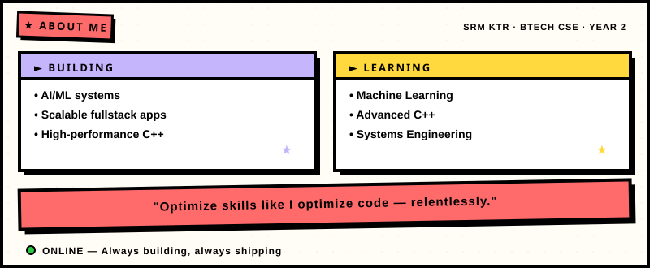
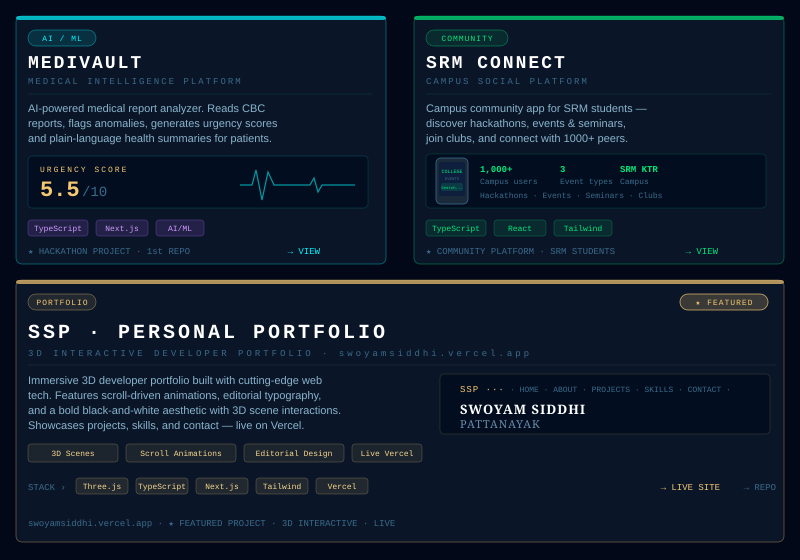
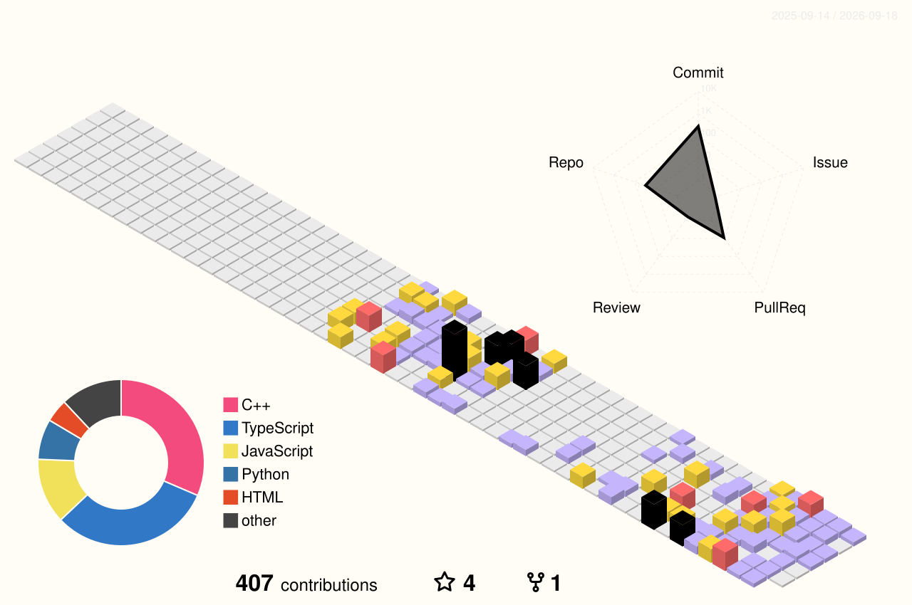

<!-- ═══════════════════════════════════════ -->
<!--  NEO-BRUTALIST HEADER BANNER           -->
<!-- ═══════════════════════════════════════ -->

 

<!-- ═══════════════════════════════════════ -->
<!--  PROFILE PICTURE                       -->
<!-- ═══════════════════════════════════════ -->

  

<!-- ═══════════════════════════════════════ -->
<!--  TYPING SVG                            -->
<!-- ═══════════════════════════════════════ -->

  

<!-- ═══════════════════════════════════════ -->
<!--  SOCIAL BADGES (neo-brutalist colors)  -->
<!-- ═══════════════════════════════════════ -->

  

---

## ★ ABOUT ME

---

## ★ TECH STACK

**`★ LANGUAGES`**

**`★ FRONTEND ARSENAL`**

**`★ BACKEND CORE`**

**`★ AI / ML SYSTEMS`**

**`★ CLOUD & INFRASTRUCTURE`**

---

## ★ PROJECTS

  

&nbsp;

---

## ★ GITHUB STATS

 

---

## ★ CONTRIBUTION GRID

  

<picture>
  <source media="(prefers-color-scheme: dark)" srcset="https://raw.githubusercontent.com/swoyamsiddhi/swoyamsiddhi/output/github-contribution-grid-snake-dark.svg">
  <source media="(prefers-color-scheme: light)" srcset="https://raw.githubusercontent.com/swoyamsiddhi/swoyamsiddhi/output/github-contribution-grid-snake.svg">
  
</picture>

  

---

 

**★ ★ ★**

*`"THE BEST WAY TO PREDICT THE FUTURE IS TO BUILD IT."`*

 

 

**`github.com/swoyamsiddhi`**

  

