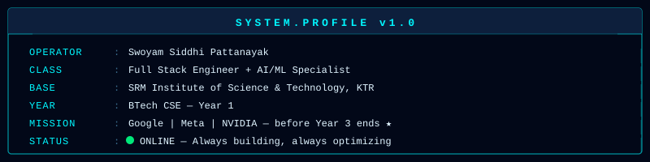
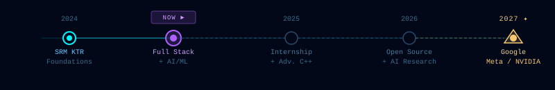

  

  

---

---

## ◈ ABOUT.ME

---

## ◈ MISSION.TIMELINE

---

## ◈ TECH.STACK

**`// LANGUAGES`**

**`// FRONTEND ARSENAL`**

**`// BACKEND CORE`**

**`// AI / ML SYSTEMS`**

**`// CLOUD & INFRASTRUCTURE`**

---

## ◈ ACTIVE.PROJECTS

<!-- Self-hosted SVG — guaranteed to render, no external dependency -->

  

<!-- Quick-link buttons to actual repos / live site -->

&nbsp;

&nbsp;

---

## ◈ GITHUB.STATS

 

---

## ◈ CONTRIBUTION.GRID

---

## ◈ SIGNAL.BROADCAST

 

*`> "The best way to predict the future is to build it."`*

 

  

